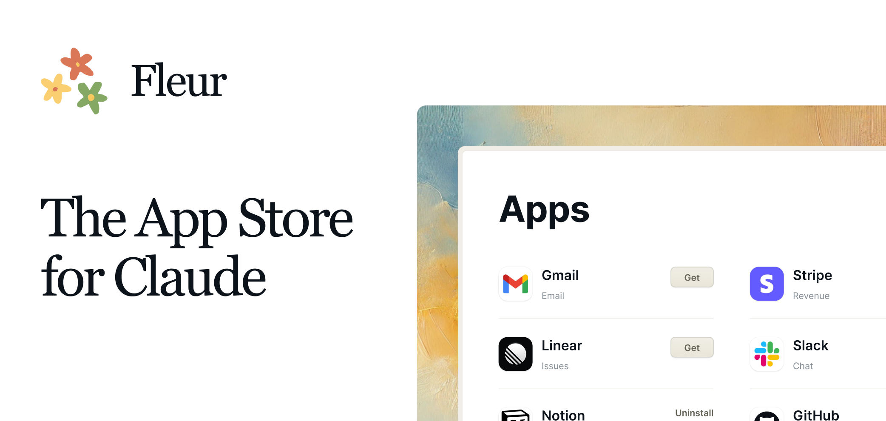

<div align="center">
  <h1>Staten</h1>
  <p>A desktop app marketplace for Claude Desktop</p>
</div>

<div align="center">

[](https://github.com/statenistes/staten/blob/main/LICENSE)

</div>


[](https://statenmcp.com)

Staten is a desktop application that serves as an app marketplace for MCPs. It allows you to discover, install, and manage apps that extend the functionality of Claude Desktop and Cursor.

All without having to use a command line. Staten is made for non-technical users in mind, but is open-source and extensible so developers can make it their own.

[📺 Demo video](https://x.com/0xferruccio/status/1898429209388675554)

## Getting Started

To install Staten you can either download the [latest release](https://github.com/statenistes/staten/releases/latest/download/Staten.dmg) or open the terminal and run the following command:

```bash
curl -fsSL staten.sh | sh
```

## Features

- **App Discovery**: Browse and search for apps in the Staten marketplace
- **Lightweight and fast**: Staten is built with Rust and Bun, making it lightweight and fast (it's less than 20MB)
- **App Installation**: Easily install apps with a single click
- **App Management**: View installed apps and their status for each client (Claude Desktop and Cursor are supported)
- **Automatic Updates**: Stay up-to-date with the latest app versions


## Submitting your MCP as an App

To submit your app to the Staten marketplace, follow these steps:

1. Clone the repository:
   ```bash
   git clone https://github.com/statenistes/app-registry.git
   cd app-registry
   ```

2. Add your app to the `apps.json` file.

3. Submit a pull request to the [app-registry repository](https://github.com/statenistes/app-registry).


## Development

### Prerequisites

- [Node.js](https://nodejs.org/) (v18 or higher)
- [Bun](https://bun.sh/) package manager
- [Rust](https://www.rust-lang.org/tools/install) (for Tauri)

### Installation

1. Clone the repository:
   ```bash
   git clone https://github.com/statenistes/staten.git
   cd staten
   ```

2. Install dependencies:
   ```bash
   bun install
   ```

3. Run the development version:
   ```bash
   bun tauri dev
   ```

### Building for Production

To build the application for production:

```bash
bun tauri build
```

## App Registry

Staten uses a centralized app registry to manage available apps. The registry is maintained at [github.com/statenistes/app-registry](https://github.com/statenistes/app-registry).

### Adding a New App

To add a new app to the registry, submit a pull request to the [app-registry repository](https://github.com/statenistes/app-registry) with your app's metadata.

## Development

### Project Structure

- `src/` - React/TypeScript frontend code
- `src-tauri/` - Rust backend code
- `public/` - Static assets

### Recommended IDE Setup

- [VS Code](https://code.visualstudio.com/) + [Tauri](https://marketplace.visualstudio.com/items?itemName=tauri-apps.tauri-vscode) + [rust-analyzer](https://marketplace.visualstudio.com/items?itemName=rust-lang.rust-analyzer)

### Running Tests

```bash
cd src-tauri
cargo test
```

## Contributing

All contributions are welcome!

- `staten`: The main repository containing the Staten app. It's built with Tauri, React and Typescript. In the `src-tauri` folder, you'll find the Rust code. And in the `src` folder, you'll find the React code for the UI.

- [`app-registry`](https://github.com/statenistes/app-registry): is the repository that contains the list of all MCPs

## License

This project is licensed under the Apache License 2.0 - see the [LICENSE](LICENSE) file for details.
